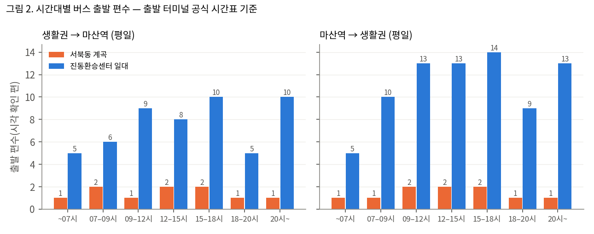
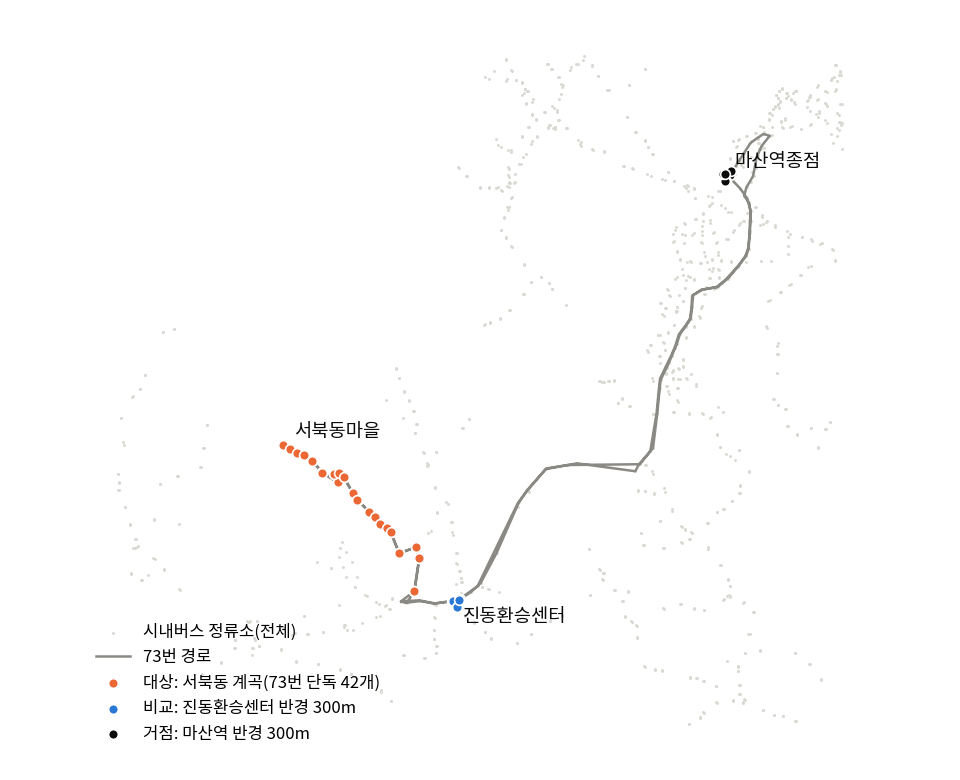
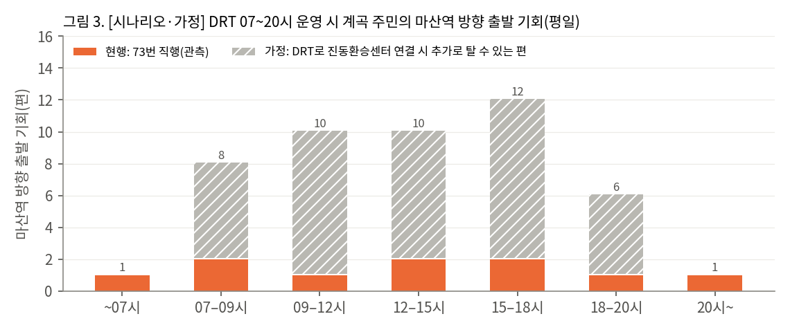

# 버스가 하루 10번 오는 마을: 서북동 계곡과 누비다 DRT 환승 연계

창원 시내버스 시간표로 버스가 드문 생활권을 찾고, 호출버스(누비다 DRT)로 인근 환승센터와 잇는 시범안을 제안한 공공데이터 분석 프로젝트입니다.
2026년 창원시 AI·데이터 활용 공모전 제출작입니다.

**대시보드:** https://claude.ai/artifact/2KT4RGkgaRAtHnmU4f1jXg (원본: `dashboard/index.html`, 브라우저로 바로 열림)

## 한눈에 보기

| | 서북동 계곡 | 진동환승센터 일대 |
|---|---|---|
| 평일 마산역 방향 출발 (시각 확인 편) | **10편** (73번 한 노선) | **53편** |
| 출근·통학 시간(07~09시) | 2편 | 6편 |
| 마산역에서 돌아오는 마지막 버스 | 21:25 | 22:45 |

- 창원 시내버스 172개 노선의 정류소를 모두 훑어, 한 노선만 서는 정류소가 가장 많이 모인 곳으로 **진북면 서북동 계곡(73번 단독 정차 42곳)**을 찾았습니다.
- 계곡 입구에서 약 2.2km 떨어진 **진동환승센터**에는 마산·창원 방향 버스가 여러 노선 모여 있습니다.
- 계곡 정류소에서는 한 주에 **331명**이 버스를 탔습니다(2025.5. 탑승 자료, 이용자가 있다는 근거로만 사용).
- **[가정]** 누비다가 07~20시에 계곡과 진동환승센터를 이어 준다면, 계곡 주민이 평일 마산역 방향으로 탈 수 있는 버스는 10편에서 48편으로 늘어납니다. 연결 가능한 시간표상 편 수이며, 실제 이용이나 대기시간 감소를 뜻하지 않습니다.



## 분석 흐름

1. **자료 확보·검증:** BIS 노선·경유정류소와 공공데이터포털 정류소 ID를 연결했고(98.9%), 공식 시간표 xlsx와 편 단위로 대조했습니다. 검증에 실패하면 결론 범위를 줄이도록 미리 정해 두었습니다.
2. **저빈도 생활권 선별:** 정류소마다 평일에 지나가는 버스 편수와 정차 노선 수를 세고, 한 노선만 서는 정류소를 노선별로 묶었습니다.
3. **대상·거점·비교 확정:** 대상 = 73번 단독 정차 42곳, 거점 = 마산역종점 반경 300m, 비교 = 진동환승센터 반경 300m.
4. **시간대별 출발 편수:** 시간표에는 기점·종점 출발 시각만 있으므로, 그 편이 해당 지점에서 출발할 때만 시각을 썼습니다. 중간 정류소 도착 시각이나 대기시간은 만들지 않았습니다.
5. **DRT 시범안(가정):** 운영 시간 2안(07~20시, 06~23시)과 차량 1대의 왕복 소요를 가정값으로 비교했습니다.





## 사용 데이터

| 자료 | 제공처 | 기준일 |
|---|---|---|
| 시내버스 노선별 운행시간표(xlsx) | 창원시 버스운영과 | 2026.9.29. |
| 창원버스정보시스템(BIS) 노선·경유정류소·시간표 | bus.changwon.go.kr | 2026.9.29. 조회 |
| 버스정류소 위치정보(CSV) | 공공데이터포털 15037805 | 2025.12.31. |
| 시내버스 탑승인원(xlsx) | 공공데이터포털 15143794 | 2025.5.19.~25. |
| 누비다 사업개편 안내, 2026 달라지는 시책 | 창원시 | 2025.12.~2026.1. |

원본은 `data/raw/`에 받은 그대로 두었고, 출처·해시·행 수는 `data/processed/source_inventory.csv`와 `report/01_data_sources.md`에 적었습니다. 각 데이터의 이용 조건은 제공처를 따릅니다.

## 재현

```bash
pip install -r requirements.txt
bash scripts/run_all.sh
```

| 스크립트 | 하는 일 |
|---|---|
| `01_inventory.py` | 원본 파일 목록·해시·행 수 |
| `02_validate.py` | 노선-정류소 연결, 공식 시간표 대조 |
| `03_screen_zones.py` | 정류소별 평일 통과 편수, 저빈도 묶음 선별 |
| `04_result_table.py` | 지점 정의, 시간대별 출발 편수 |
| `05_crosscheck_official.py` | 73·80번 편별 공식 대조 |
| `06_drt_scenario.py` | 탑승 관측, 거리, DRT 시나리오(가정) |
| `07_figures.py` | 그림 |
| `09_dashboard.py` | 대시보드(`dashboard/index.html`) |

## 원칙과 한계

- 관측 결과와 가정 시나리오를 표·그림 제목에 [관측]/[가정]으로 나눠 표기했습니다.
- 수요·예약 자료가 없어 최적 차량 수나 대기시간 감소는 주장하지 않았습니다.
- 토요일 시간표, 정류소별 도착 시각, 계곡 주민 수와 목적지, 실제 대기시간 자료는 확보하지 못했습니다.
- BIS 자료는 공식 Open API가 아니라 웹 조회 결과를 저장한 것이며, 공식 xlsx와 편 단위로 대조해 검증했습니다.
- 분석보고서 원문(hwpx)은 공모전 결과 발표 뒤 공개할 예정입니다.

## 기술

Python 3 (pandas, openpyxl, numpy, matplotlib), HTML/CSS/JS(정적 대시보드, 데이터 내장)
