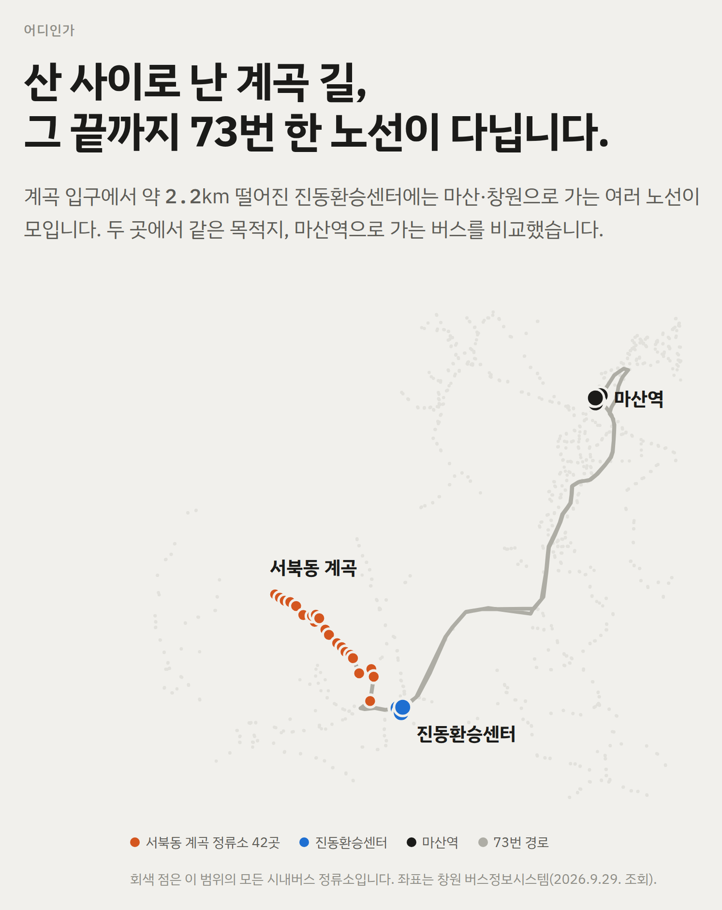
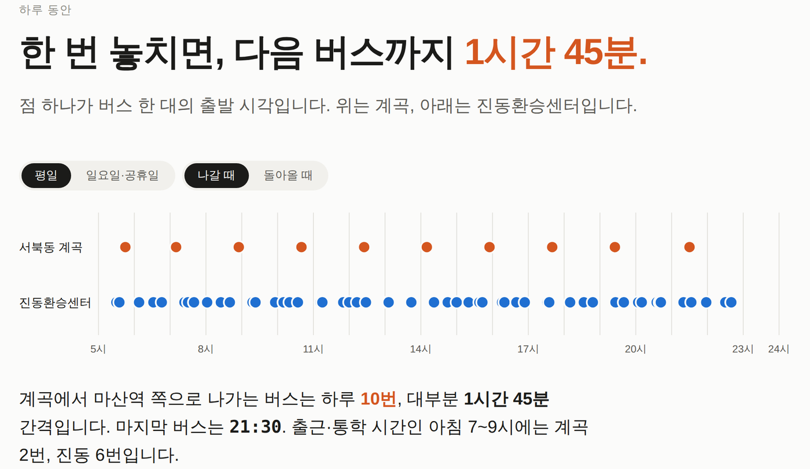
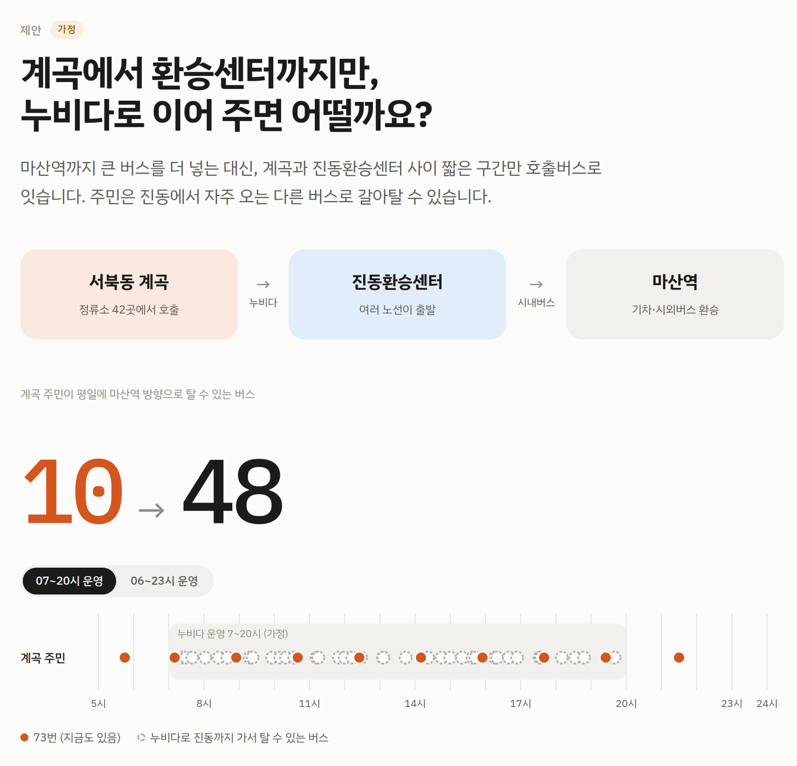
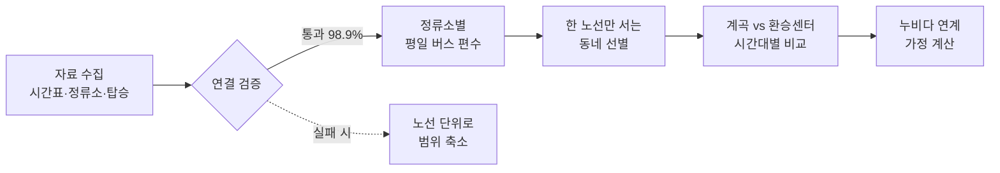

<div align="center">

# 서북동 계곡 버스 공백 분석과 누비다 환승 연계 제안

<b>창원 시내버스 시간표로 버스가 드문 동네를 찾고,<br>호출버스로 가까운 환승센터와 잇는 방안을 제안한 공공데이터 분석</b>

[](https://claude.ai/artifact/2KT4RGkgaRAtHnmU4f1jXg)


<sub>대시보드 첫 화면. 여기서 "10번"은 버스가 10번 출발한다는 뜻입니다(아래 본문에서는 '편'으로 씁니다).</sub>

</div>

## 30초 요약

| | |
|---|---|
| <b>문제</b> | 창원시는 호출버스 '누비다'를 늘릴 계획이지만, 어느 동네에 먼저 필요한지 보여 주는 근거가 부족합니다. |
| <b>방법</b> | 창원 시내버스 172개 노선의 정류소와 시간표를 모아, 한 노선만 드물게 다니는 동네를 찾았습니다. |
| <b>발견</b> | 진북면 서북동 계곡은 평일 마산역 방향 버스가 <b>하루 10편</b>(73번)뿐입니다. 약 2.2km 떨어진 진동환승센터에서는 같은 방향 버스가 <b>53편</b> 출발합니다. |
| <b>제안</b> | 계곡과 진동환승센터 사이만 누비다로 이어 주면, 계곡 주민이 탈 수 있는 마산역 방향 버스가 <b>10편 → 48편</b>이 됩니다. <i>(누비다 07\~20시 운영을 가정한 계산)</i> |

<b>역할:</b> 개인 프로젝트. 자료 수집, 데이터 검증, 분석, 시각화, 대시보드 제작을 모두 직접 했습니다.

## 먼저 알아 두면 좋은 말

| 용어 | 뜻 |
|---|---|
| <b>누비다</b> | 창원시의 수요응답형 교통(DRT). 정해진 노선 없이 앱으로 불러서 타는 소형 버스입니다. (공영자전거 '누비자'와는 다릅니다) |
| <b>서북동 계곡</b> | 이 분석에서 붙인 이름. 창원시 마산합포구 진북면의 계곡 길을 따라 덕곡입구(계곡 입구)부터 서북동마을(가장 안쪽)까지, 시내버스 73번만 서는 정류소 42곳입니다. |
| <b>진동환승센터</b> | 계곡 입구에서 가까운 진동면의 버스 환승 거점. 마산·창원으로 가는 여러 노선이 출발합니다. |
| <b>마산역</b> | 73번의 종점이자 기차·시외버스로 갈아타는 거점. 두 지역에서 같은 목적지로 가는 버스를 비교하려고 목적지로 정했습니다. |
| <b>편</b> | 버스 한 번의 운행. "하루 10편"은 하루에 버스가 10번 출발한다는 뜻입니다. |
| <b>BIS</b> | 창원버스정보시스템. 노선·정류소·시간표를 제공합니다. |

## 무엇을 찾았나

### 1. 한 노선에만 기대는 동네

창원의 모든 시내버스 정류소를 조사해, 한 노선만 서는 정류소를 노선별로 묶었습니다. 가장 큰 묶음이 73번만 서는 <b>서북동 계곡(42곳, 평일 10편)</b>이었습니다. 2위는 62번만 서는 구산면 일대(34곳, 평일 16편)였습니다.



<sub>대시보드 화면. 회색 점은 이 범위의 모든 시내버스 정류소입니다.</sub>

### 2. 한 번 놓치면 1시간 45분

점 하나가 버스 한 편의 출발 시각입니다. 계곡(주황)은 대부분 1시간 45분 간격이고, 진동환승센터(파랑)는 훨씬 촘촘합니다.



<sub>대시보드 화면(평일, 마산역 방향). 대시보드에서는 휴일과 돌아오는 방향도 볼 수 있습니다.</sub>

| 평일 | 서북동 계곡 | 진동환승센터 |
|---|---:|---:|
| <b>마산역 방향</b> 출발 | 10편 | 53편 |
| 그중 출근·통학 시간(07\~09시) | 2편 | 6편 |
| 마산역 방향 마지막 출발 | 21:30 | 22:40 |
| <b>돌아오는 방향</b>(마산역 출발) | 10편 | 77편 |
| 돌아오는 마지막 버스 | 21:25 | 22:45 |

진동환승센터 53편은 반경 300m 안 정류소에서 <b>출발하는</b> 버스(3003·64·64-1·80번)만 센 값입니다. 다른 곳에서 출발해 진동을 지나가기만 하는 버스(73번 포함 80편)는 그곳을 지나는 시각이 시간표에 없어서 뺐습니다.

### 3. 실제로 타는 사람이 있다

계곡 정류소에서는 한 주에 <b>331명</b>이 버스를 탔습니다(2025년 5월 1주 탑승 기록). 이 숫자는 이용자가 있다는 근거로만 썼고, 수요를 추정하는 데는 쓰지 않았습니다.

## 제안: 환승센터까지만 누비다로 잇기 `가정`

마산역까지 큰 버스를 더 넣는 대신, 계곡과 진동환승센터 사이 짧은 구간만 누비다로 잇습니다. 주민은 진동에서 자주 출발하는 다른 버스로 갈아탑니다.



<sub>대시보드 화면. 주황 점은 지금 다니는 73번, 점선 원은 누비다로 진동까지 가서 탈 수 있는 버스입니다.</sub>

<b>48편이 나온 계산:</b> 73번 10편 + 누비다 운영 시간(07\~20시) 안에 진동에서 출발하는 마산역 방향 버스 38편 = 48편입니다. 운영 시간을 06\~23시로 넓히면 진동 53편 중 51편이 들어가 61편이 됩니다(06시 전에 출발하는 2편 제외).

| 항목 | 내용 | 근거 |
|---|---|---|
| 권역 | 덕곡입구\~서북동마을 정류소 42곳(기존 정류소를 호출 장소로 사용) | 시간표 분석 |
| 환승 거점 | 진동환승센터 | 시간표 분석 |
| 운영 시간 | 07\~20시, 넓히면 06\~23시 | 가정 |
| 차량 | 1대. 시속 30km 가정 시 가장 먼 마을까지 왕복 약 45분 | 가정 |

> <b>숫자를 읽는 법:</b> 48편은 시간표상 "갈아탈 수 있는 버스"의 수입니다. 차량 1대가 왕복에 약 45분 걸리므로 모든 편에 맞춰 데려다줄 수는 없고, 실제로 기다리는 시간이 얼마나 줄어드는지는 시범 운영 기록으로 확인해야 합니다.

## 어떻게 분석했나



1. <b>먼저 검증했습니다.</b> 버스정보시스템의 노선별 정류소 17,156건 중 98.9%를 공공데이터포털 정류소와 연결했습니다. 연결되지 않은 정류소 81곳은 2026년 9월 노선 조정으로 새로 생긴 곳처럼 정류소 파일(2025년 말 기준)에 아직 없는 곳이며, 좌표는 버스정보시스템 값을 썼습니다. 결과표에 쓴 노선은 공식 시간표 파일과 버스 한 편 단위로 대조해 모두 일치했습니다.
2. <b>정류소마다 버스 편수를 셌습니다.</b> 평일 하루 지나가는 버스 수와 정차 노선 수를 세고, 한 노선만 서는 정류소를 노선별로 묶었습니다.
3. <b>비교 대상을 정했습니다.</b> 계곡(73번만 서는 정류소 42곳)과 진동환승센터(반경 300m)에서 같은 목적지인 마산역으로 가는 버스를 비교했습니다.
4. <b>시간대별로 셌습니다.</b> 시간표에는 버스가 출발하는 곳의 시각만 있어서, 그 지점에서 출발하는 버스만 시각을 썼습니다.
5. <b>누비다 운영을 가정해 계산했습니다.</b> 운영 시간 2안과 차량 1대의 왕복 시간을 가정값으로 두고 비교했습니다.

## 분석하면서 지킨 원칙

- <b>없는 숫자는 만들지 않았습니다.</b> 시간표에 없는 중간 정류소 도착 시각이나 대기시간을 첫차·막차·배차 간격으로 추정하지 않았습니다.
- <b>관측과 가정을 나눴습니다.</b> 표와 그림마다 실제 자료로 센 것인지, 가정으로 계산한 것인지 표시했습니다.
- <b>말할 수 있는 만큼만 말했습니다.</b> 수요·예약 자료가 없어 최적 차량 수나 대기시간 감소는 주장하지 않았습니다.
- <b>누구나 다시 돌릴 수 있게 했습니다.</b> 원본은 받은 그대로 두고, 스크립트 하나로 결과표·그림·대시보드를 다시 만듭니다.

## 한계

- 토요일 시간표(버스정보시스템에서 제공하지 않음), 정류소별 도착 시각, 계곡 주민 수와 목적지, 실제 대기시간 자료는 없었습니다.
- 탑승 기록은 2025년 5월, 시간표는 2026년 9월 기준이라 시점이 다릅니다.
- 버스정보시스템 자료는 공식 Open API가 아니라 웹 조회 결과를 저장한 것입니다. 대신 공식 시간표 파일과 편 단위로 대조해 검증했습니다.
- 거리는 정류소 사이 직선거리의 합이라 실제 도로 거리보다 짧습니다.

<details>
<summary><b>사용 데이터</b></summary>

| 자료 | 제공처 | 기준일 |
|---|---|---|
| 시내버스 노선별 운행시간표(xlsx) | 창원시 버스운영과 | 2026.9.29. |
| 창원버스정보시스템(BIS) 노선·경유정류소·시간표 | [bus.changwon.go.kr](https://bus.changwon.go.kr) | 2026.9.29. 조회 |
| 버스정류소 위치정보(CSV) | 공공데이터포털 15037805 | 2025.12.31. |
| 시내버스 탑승인원(xlsx) | 공공데이터포털 15143794 | 2025.5.19.\~25. |
| 누비다 사업개편 안내, 2026 달라지는 시책 | 창원시 | 2025.12.\~2026.1. |

원본은 `data/raw/`에 받은 그대로 두었고, 출처·해시·행 수는 [`report/01_data_sources.md`](report/01_data_sources.md)와 `data/processed/source_inventory.csv`에 있습니다. 각 데이터의 이용 조건은 제공처를 따릅니다.

</details>

<details>
<summary><b>직접 실행하기</b></summary>

```bash
pip install -r requirements.txt
bash scripts/run_all.sh
```

| 스크립트 | 하는 일 |
|---|---|
| `01_inventory.py` | 원본 파일 목록·해시·행 수 |
| `02_validate.py` | 노선-정류소 연결, 공식 시간표 대조 |
| `03_screen_zones.py` | 정류소별 평일 버스 편수, 한 노선만 서는 동네 선별 |
| `04_result_table.py` | 비교 지점 정의, 시간대별 출발 편수 |
| `05_crosscheck_official.py` | 73·80번 편별 공식 시간표 대조 |
| `06_drt_scenario.py` | 탑승 기록, 거리, 누비다 연계 가정 계산 |
| `07_figures.py` | 보고서용 그림(`report/figures/`) |
| `09_dashboard.py` | 대시보드(`dashboard/index.html`, 데이터 내장이라 브라우저로 바로 열림) |

08번(공모전 제출 문서 생성)은 이 저장소에 포함하지 않았습니다.

```
data/raw/         원본(수정하지 않음)
data/processed/   스크립트가 만든 검증표·결과표
scripts/          분석 스크립트
dashboard/        대시보드
report/           자료 출처·검증 기록, 보고서용 그림
docs/             README 이미지(대시보드 캡처)
```

</details>
